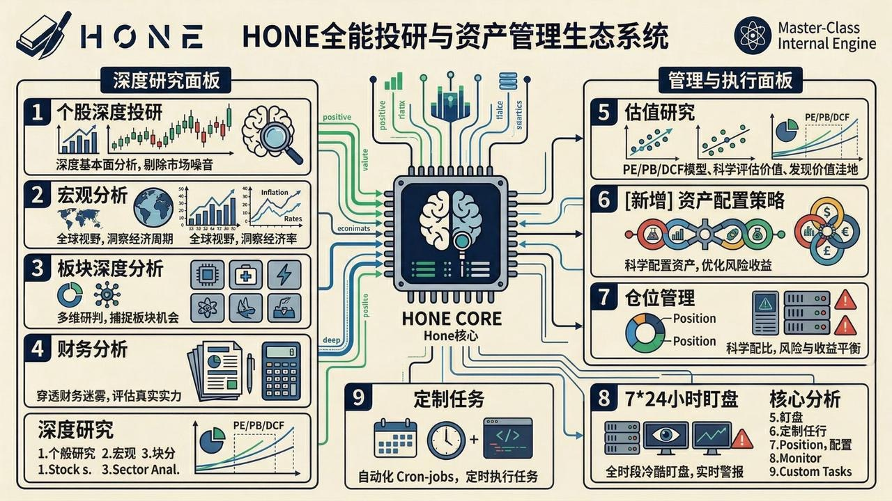

<p align="center">
  
</p>

---

<p align="center">
  <strong>“并非迎合你的聊天玩具，而是你投资纪律的无情捍卫者。”</strong><br>
  HoneClaw专注于成为懂你的，专业投资助手。<br><br>
  <strong>为什么取名Hone：</strong><br>
  Hone 的意思，是磨刀、打磨锋刃。而真正严肃的投资，本质上就是这样一个过程：不是追逐每一条新闻，不是对每一次涨跌做情绪化反应，而是在研究、比较、复盘和长期纪律中，不断磨砺自己的判断力。
</p>

<p align="center">
  <strong>简体中文</strong> | <a href="./README_EN.md">English</a> 
</p>

<p align="center">
  <strong>💬 社群:</strong> <a href="https://discord.gg/TyDNfYXDGF" target="_blank">Discord</a> 
</p>

---

# 1. 🦅 Honeclaw (Hone Financial)

Honeclaw（或称 Hone）是一个使用**Rust**编写的开源个人投研辅助助手。与市面上习惯于附和用户的“闲聊机器人”不同，Honeclaw 被设计为一个**具备冷静思考能力、客观且克制的投研助手**。

<p align="center">
  <a href="./resources/hone_solution_zh.jpg" target="_blank">
    
  </a>
  &nbsp;&nbsp;
  <a href="./resources/hone_introduction_zh.jpg" target="_blank">
    
  </a>
</p>

它通过多端渠道（飞书、discord、telegram、imessages）接入你的日常工作流，帮助你跟踪持仓公司动态、执行严格的投资纪律、执行定时监控任务，并在你情绪化交易时提供理性的数据与逻辑对抗。

# 2. ✨ 核心特性 (Key Features)

- 🧠 **绝对理性的投研内核**：不附和、不盲从。在你做出投资决策时，它会基于数据和预设纪律进行交叉验证，指出你的逻辑漏洞。
- 📱 **全平台无缝接入**：支持 iMessage, 飞书 (Lark), Telegram, Discord，随时随地与你的投资大脑进行对话。
- 📊 **持仓监控与纪律管理**：设定你的止盈止损线、加仓逻辑与核心关注指标，Hone 会像冷酷的守望者一样帮你盯盘。
- ⏰ **强大的定时任务 (Cron-jobs)**：支持复杂的定时监控任务，例如盘前摘要、盘后总结、特定财报发布后的自动解析等。
- ⚡ **极致性能**：底层完全使用 Rust 构建，内存占用极低，并发处理能力极强，确保多端消息的毫秒级响应。

<p align="center">
  <a href="./resources/hone_channels_zh.jpg" target="_blank">
    
  </a>
  &nbsp;&nbsp;
  <a href="./resources/hone_work_zh.jpg" target="_blank">
    
  </a>
</p>


# 3. 🏗️ 快速开始 (Getting Started)


## 前置依赖

- **Basic Env**: A basic Unix/Linux environment (macOS / Ubuntu recommended) 
- **Rust**: Edition 2021+

## 安装与启动

1. 克隆仓库
2. 

```shell 
git clone https://github.com/your-username/honeclaw.git
cd honeclaw
```

3. 一键启动

系统内置了启动脚本，将自动编译并拉起服务：

```shell
chmod +x launch.sh
./launch.sh --desktop
```


** 🧠 启动过程中发生了什么？**

启动脚本不仅是简单的运行命令，它承载了整个全栈环境的自动化编排。在第一次启动时，脚本会依次执行以下任务（预计耗时约 **10 分钟**）：

- **环境嗅探与同步**：自动检测 `bun`、`rustup` 等必要运行时，同步相关依赖包。
- **全量代码编译**：
  - **后端 (Rust)**: 编译桌面外壳 (`hone-desktop`)、核心后端引擎 (`hone-web-api`) 以及各个通讯渠道 Sidecars。
  - **前端 (SolidJS/Vite)**: 构建并动态加载桌面交互 UI。
- **服务拉起**：脚本会通过进程守护模式同时启动本地 Web 服务、嵌入式数据库访问层，并为您自动打开桌面版窗口。

** 配置模型与推理引擎 **

应用启动后，您需要为系统的 Agent 系统配置“大脑”。

1. **进入设置**：点击主界面左下角的 **⚙️ 设置 (Settings)** 按钮。
2. **基础设置**：在 Agent 设置部分，您可以选择您偏好的推理方式：
   - **本地引擎 (Zero Config)**：如果您本地已经安装并运行了 `gemini cli` 或 `codex`，系统会自动发现。无需任何复杂配置，直接在下拉菜单选择即可开始。
   - **云端接入 (推荐)**：如果您没有本地引擎，可以配置支持 **OpenAI 协议** 的第三方服务。
     - **推荐组合**：`OpenRouter` + `Gemini 3.1 Pro/Flash`。
     - **原因**：根据我们的大量性能测试，该方案在逻辑推理深度、响应延迟以及 Context 吞吐量上表现最为均衡。


# 4. 🌰 一些案例

<table>
<tr>
<th align="center">1. 正常问答</th>
<th align="center">2. Discord 群聊</th>
<th align="center">3. 定时播报</th>
</tr>
<tr>
<td valign="top" align="center"></td>
<td valign="top" align="center"></td>
<td valign="top" align="center"></td>
</tr>
</table>

以上截图仅为示意；Honeclaw 还支持**更多用法与配置**，可在使用过程中逐步解锁。

[`CASES_ZH.md`](CASES_ZH.md) 汇总了 Hone 的**贴近真实场景的问答示例**（个股逻辑、追问基本面、结合持仓的每日建议、深度研究、定时任务、主题挖掘与宏观等），在 GitHub 上以两列表格呈现，便于浏览。英文版见 [`CASES_EN.md`](CASES_EN.md)。

# 5. 💡 维护者寄语

“市场充满杂音，贪婪与恐惧是投资者的宿敌。希望 Honeclaw 能够成为你在交易市场中最冷静的锚。”

为遵守开源许可要求，一些专业估值工具、投研工作流以及专有知识库未包含在此公开仓库中。

这些内容包括但不限于：
-  高级 DCF 与相对估值模型 
-  行业专项深度研究工作流 
-  精选整理的投研知识库（如财报电话会纪要、分析师报告资料库） 

如果你有兴趣获取这些能力，欢迎联系我们：

1. - [YouTube: 巴芒投研美股频道](https://www.youtube.com/@%E5%B7%B4%E8%8A%92%E6%8A%95%E7%A0%94%E7%BE%8E%E8%82%A1%E9%A2%91%E9%81%93) — 欢迎关注，获取投研内容


2. - [Discord](https://discord.gg/TyDNfYXDGF): 通过邀请码链接 (https://discord.gg/TyDNfYXDGF) 加入我们的社区频道


# 6. 🤝 Contributing

Honeclaw 致力于成为开源社区中最专业的个人投研基础设施。如果你对 Rust 后端开发、大模型 Prompt 工程或金融数据分析感兴趣，欢迎提交 PR。

贡献者：

- [carlisle0615](https://github.com/carlisle0615)
- [Finn-Fengming](https://github.com/Finn-Fengming)

📄 License

本项目采用 Apache-2.0 协议.