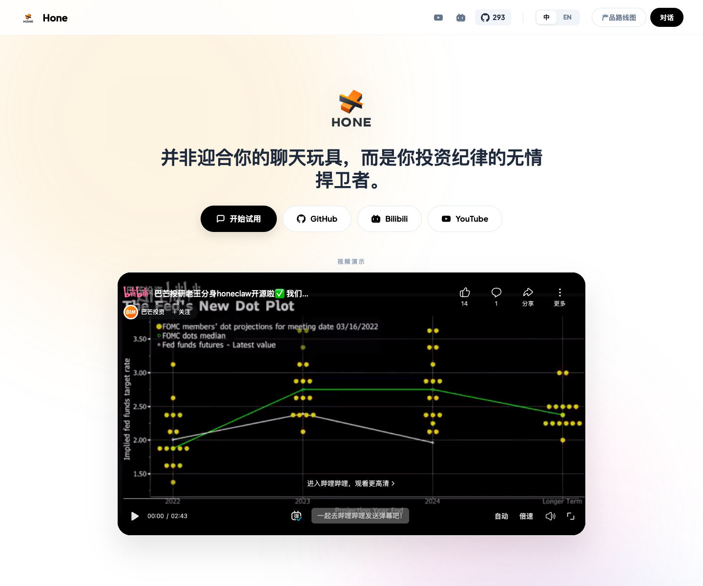
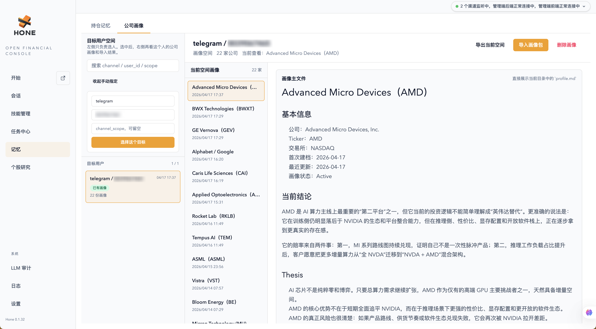

<p align="center">
  
</p>
<p align="center">
  <strong> Hone </strong><br>
  <strong>“Not a chat toy designed to indulge you, but a ruthless defender of your investment discipline.”</strong><br>
  <em>HoneClaw is dedicated to being a professional investment assistant that truly understands you.</em>

Why the name Hone:

"Hone" means to sharpen, to refine an edge. And serious investing is fundamentally just that kind of process: it is not about chasing every piece of news, nor reacting emotionally to every rise and fall, but about continuously honing one’s judgment through research, comparison, review, and long-term discipline.

</p>

<p align="center">
  <strong>English</strong> | <a href="./README_ZH.md">简体中文</a> | <strong>Website:</strong> <a href="https://hone-claw.com" target="_blank">hone-claw.com</a> | <strong>💬 Community:</strong> <a href="https://discord.gg/TyDNfYXDGF" target="_blank">Discord</a>
</p>

---

# 1. 🦅 Honeclaw (Hone Financial)

Honeclaw (or simply Hone) is an open-source personal investment research assistant written in Rust. Unlike the “chatbots” on the market that are accustomed to agreeing with users, Honeclaw is designed as a co-pilot for investment research that is capable of calm thinking, objective judgment, and disciplined restraint.

It integrates into your daily workflow across multiple platforms, helping you track developments at companies you hold, enforce strict investment discipline, run scheduled monitoring tasks, and counter emotional trading impulses with rational data and logic.

The public product website is now live at **[hone-claw.com](https://hone-claw.com)**. It introduces Hone from the user-facing angle: what Hone is, how public chat works, how portfolio monitoring and scheduled tasks fit into daily research, and where to find the roadmap, GitHub repo, Bilibili, and YouTube demos.

<p align="center">
  
</p>

**Architecture**: [Interactive system architecture (HTML)](./resources/architecture.html) — after cloning the repo, open this file in a browser locally to view the diagram.

**Wiki**: [Complete repository guide and startup wiki](./docs/wiki.md) — includes the directory map, runtime layout, install paths, source startup modes, ports, configuration, verification, and troubleshooting.

# 2. ✨ Key Features

- 🧠 **An Absolutely Rational Core**: It does not flatter and does not follow blindly. When you make investment decisions, it cross-checks them against data and predefined discipline, identifying flaws in your reasoning.
- 📱 **Seamless Cross-Platform Access**: Supports Web, iMessage, Lark, Telegram, and Discord, so you can engage with your investment brain anytime, anywhere.
- 🗂️ **Company Portraits & Long-term Memory**: Hone can continuously accumulate company profiles and event timelines in Markdown, helping you preserve thesis, key operating metrics, risks, and major developments as a reusable long-term research asset.
- 📊 **Position Monitoring & Discipline**: Set your take-profit and stop-loss levels, add-to-position logic, and key indicators to watch, and Hone will monitor the market for you like a cold, vigilant sentinel.
- ⏰ **Powerful Scheduled Tasks (Cron Jobs)**: Supports complex scheduled monitoring tasks, such as pre-market briefings, post-market summaries, and automatic analysis after specific earnings releases.
- ⚡ **Rust-powered Extreme Performance**: Built entirely in Rust at the core, ensuring millisecond-level responsiveness for messages across multiple platforms with minimal footprint.

<p align="center">
  <a href="./resources/hone_channels.jpg" target="_blank">
    
  </a>
  &nbsp;&nbsp;
  <a href="./resources/hone_solution.jpg" target="_blank">
    
  </a>
</p>

<p align="center">
  <a href="https://hone-claw.com" target="_blank">
    
  </a>
</p>
<p align="center">
  <em>Official website: <a href="https://hone-claw.com">hone-claw.com</a> introduces Hone’s public chat, portfolio tracking, scheduled tasks, long-term company memory, cross-platform notifications, and roadmap.</em>
</p>

<p align="center">
  
</p>
<p align="center">
  <em>Company Portraits Dashboard: A centralized UI to manage long-term research memories, sync thesis developments from chats, and review your customized company knowledge base.</em>
</p>

# 3. 🏗️ Getting Started

## Prerequisites

- **Environment**: A Unix-like system (**macOS** or **Ubuntu** recommended).
- **Rust**: Toolchain **Edition 2021** or newer.

### Tech stack

- **System core**: Rust (Tokio, Axum, SSE)
- **Backend**: Rust
- **Client** (desktop): Rust (Tauri)
- **Frontend**: SolidJS + Tailwind v4 (Ultra-fast, Clean UI)

### Supported channels

- **Web Console**: Modern browser interface with interactive charts.
- **Mac App**: Native macOS desktop experience.
- **IM Integration**: Feishu (Lark), Discord, Telegram, iMessage.

## Installation and Launch

For the full startup matrix, directory guide, ports, configuration, and troubleshooting notes, see the [Hone Wiki](./docs/wiki.md).

### Option A. One-line Install (macOS/Linux)

```shell
curl -fsSL https://raw.githubusercontent.com/B-M-Capital-Research/honeclaw/main/scripts/install_hone_cli.sh | bash
hone-cli doctor
hone-cli onboard
hone-cli start
```

### Option B. Homebrew (macOS/Linux)

```shell
brew install B-M-Capital-Research/honeclaw/honeclaw
hone-cli doctor
hone-cli onboard
hone-cli start
```

### Option C. Development Mode

```shell
git clone https://github.com/B-M-Capital-Research/honeclaw.git
cd honeclaw
./launch.sh --desktop
```

---

# 4. 🌰 Examples

<table>
<tr>
<th align="center">1. Standard Q&amp;A</th>
<th align="center">2. Discord chat</th>
<th align="center">3. Scheduled briefings</th>
</tr>
<tr>
<td valign="top" align="center"></td>
<td valign="top" align="center"></td>
<td valign="top" align="center"></td>
</tr>
</table>

[`CASES_EN.md`](CASES_EN.md) collects **real-world Q&A examples** covering single-stock logic, daily suggestions, deep dives, and macro analysis.

# 5. 💡 A Note from the Maintainer

> “The market is full of noise, and greed and fear are the investor’s greatest enemies. I hope Honeclaw can become your calmest anchor in the trading market.”

To comply with open-source licensing requirements, a number of **professional valuation tools, investment research workflows, and proprietary knowledge bases** are not included in this public repository.

If you are interested in accessing these capabilities, feel free to reach out to us:

1. [YouTube: 巴芒投研美股频道](https://www.youtube.com/@%E5%B7%B4%E8%8A%92%E6%8A%95%E7%A0%94%E7%BE%8E%E8%82%A1%E9%A2%91%E9%81%93)
2. [BiliBili: 巴芒投资](https://space.bilibili.com/224670487)
3. [Discord Community](https://discord.gg/TyDNfYXDGF)

# 6. 🤝 Contributing

We welcome all forms of contributions! Whether it's Rust backend dev, LLM prompt engineering, or financial data analysis.

📄 License

This project is open-sourced under the MIT license.

## Star History

<a href="https://www.star-history.com/?repos=B-M-Capital-Research%2Fhoneclaw&type=date&logscale=&legend=top-left">
 <picture>
   <source media="(prefers-color-scheme: dark)" srcset="https://api.star-history.com/chart?repos=B-M-Capital-Research/honeclaw&type=date&theme=dark&legend=top-left" />
   <source media="(prefers-color-scheme: light)" srcset="https://api.star-history.com/chart?repos=B-M-Capital-Research/honeclaw&type=date&legend=top-left" />
   
 </picture>
</a>
