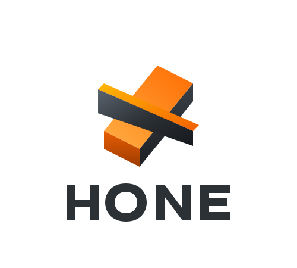
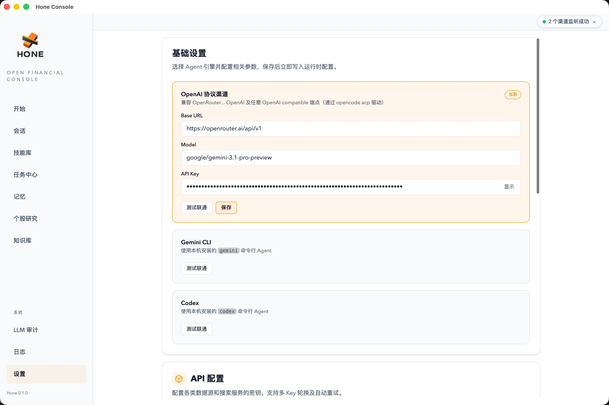

<p align="center">
  
</p>
<p align="center">
  <strong> Hone </strong><br>
  <strong>“Not a chat toy designed to indulge you, but a ruthless defender of your investment discipline.”</strong><br>
  <em>HoneClaw is dedicated to being a professional investment assistant that truly understands you.</em>

Why the name Hone:

"Hone" means to sharpen, to refine an edge. And serious investing is fundamentally just that kind of process: it is not about chasing every piece of news, nor reacting emotionally to every rise and fall, but about continuously honing one’s judgment through research, comparison, review, and long-term discipline.

</p>

<p align="center">
  <strong>English</strong> | <a href="./README_ZH.md">简体中文</a>  | <strong>💬 Community:</strong> <a href="https://discord.gg/TyDNfYXDGF" target="_blank">Discord</a>
</p>

---

# 1. 🦅 Honeclaw (Hone Financial)

Honeclaw (or simply Hone) is an open-source personal investment research assistant written in Rust. Unlike the “chatbots” on the market that are accustomed to agreeing with users, Honeclaw is designed as a co-pilot for investment research that is capable of calm thinking, objective judgment, and disciplined restraint.

It integrates into your daily workflow across multiple platforms, helping you track developments at companies you hold, enforce strict investment discipline, run scheduled monitoring tasks, and counter emotional trading impulses with rational data and logic.

<p align="center">
  
</p>

**Architecture**: [Interactive system architecture (HTML)](./resources/architecture.html) — after cloning the repo, open this file in a browser locally to view the diagram.

# 2. ✨ Key Features

-  🧠 An Absolutely Rational Investment Research Core: It does not flatter and does not follow blindly. When you make investment decisions, it cross-checks them against data and predefined discipline, identifying flaws in your reasoning.
-  📱 Seamless Cross-Platform Access: Supports iMessage, Lark, Telegram, and Discord, so you can engage with your investment brain anytime, anywhere.
-  📊 Position Monitoring and Discipline Management: Set your take-profit and stop-loss levels, add-to-position logic, and key indicators to watch, and Hone will monitor the market for you like a cold, vigilant sentinel.
-  ⏰ Powerful Scheduled Tasks (Cron Jobs): Supports complex scheduled monitoring tasks, such as pre-market briefings, post-market summaries, and automatic analysis after specific earnings releases.
-  ⚡ Extreme Performance: Built entirely in Rust at the core, with very low memory usage and exceptionally strong concurrent processing capabilities, ensuring millisecond-level responsiveness for messages across multiple platforms.

<p align="center">
  <a href="./resources/hone_channels.jpg" target="_blank">
    
  </a>
  &nbsp;&nbsp;
  <a href="./resources/hone_solution.jpg" target="_blank">
    
  </a>
</p>

<p align="center">
  
</p>

# 3. 🏗️ Getting Started

## Prerequisites

- **Environment**: A Unix-like system (**macOS** or **Ubuntu** recommended).
- **Rust**: Toolchain **Edition 2021** or newer.

### Tech stack

- **System core**: Rust
- **Backend**: Rust
- **Client** (desktop): Rust
- **Frontend**: TypeScript

### Supported channels

- Mac app (macOS)
- Feishu (Lark)
- Discord
- Telegram
- iMessage

## Installation and Launch

### Option A. Install the macOS/Linux CLI bundle from GitHub

```shell
curl -fsSL https://raw.githubusercontent.com/B-M-Capital-Research/honeclaw/main/scripts/install_hone_cli.sh | bash
hone-cli doctor
hone-cli onboard
hone-cli start
```

This path installs the GitHub release bundle under `~/.honeclaw`, writes a `hone-cli` wrapper into `~/.local/bin`, and lets you start the local runtime directly with `hone-cli start` instead of `./launch.sh`.

If you choose `opencode_acp` during onboarding, Hone now expects you to finish provider/auth/default-model setup in local `opencode` first, then simply reuses that local OpenCode config by default.

### Option B. Clone the repository for development

1. Clone the repository

```shell
git clone https://github.com/B-M-Capital-Research/honeclaw.git
cd honeclaw
```

2. One-click launch

The repo ships with a launch script that compiles and starts the full local stack:

```shell
chmod +x launch.sh
./launch.sh --desktop
```

### What the first repo startup does

Running `./launch.sh --desktop` walks through **environment prep → builds → process bring-up** in order. The **first** full run usually takes about **10 minutes** (depends on network and CPU).

1. **Runtimes & dependencies**: Ensures tools like `bun` and `rustup` are available and installs/syncs project dependencies.
2. **Build**
   - **Rust backend**: `hone-desktop` (shell), `hone-web-api` (core API), and per-channel **sidecars**.
   - **Frontend**: SolidJS + Vite desktop UI, loaded by the shell.
3. **Bring-up**: Starts the local web stack and data layer under a supervisor and **opens** the desktop window.

### After the window opens: choose the Agent’s inference backend

You now decide whether the Agent uses a **local CLI** or an **OpenAI-compatible cloud API**.

1. Click **⚙️ Settings** in the lower-left of the main window.
2. In the **Agent / inference** section, pick one path:
   - **Local engine (zero config)**: If `gemini cli` or `codex` is installed and running, Hone can discover it—select it from the dropdown; usually no extra fields.
   - **Cloud API (recommended)**: Otherwise, configure any **OpenAI-compatible** HTTP API (base URL, API key, etc., per provider).
     - **Suggested pairing**: `OpenRouter` + `Gemini 3.1 Pro` or `Gemini 3.1 Flash`.
     - **Note**: In our testing, this pairing balances reasoning depth, latency, and context throughput well.

The next section’s screenshots show the full **model and channel** setup.

## After startup, configure models and channels in the client app settings

<p align="center">
  <a href="./resources/hone_page.jpg" target="_blank">
    
  </a>
  &nbsp;&nbsp;
  <a href="./resources/hone_setting.jpg" target="_blank">
    
  </a>
</p>
<p align="center">
  <em>Left: desktop home—main chat surface, start talking to Hone right away.</em>
  &nbsp;&nbsp;
  <em>Right: Settings—inference backend (cloud or local) and channels such as Feishu, Discord, Telegram, and iMessage.</em>
</p>

---

# 4. 🌰 Examples

<table>
<tr>
<th align="center">1. Standard Q&amp;A</th>
<th align="center">2. Discord chat</th>
<th align="center">3. Scheduled briefings</th>
</tr>
<tr>
<td valign="top" align="center"></td>
<td valign="top" align="center"></td>
<td valign="top" align="center"></td>
</tr>
</table>

These screenshots are illustrative only—Honeclaw supports **many more workflows and setups** you can unlock as you go.

[`CASES_EN.md`](CASES_EN.md) collects **real-style Q&A examples** from Hone (single-stock logic, follow-up questions, daily portfolio-aware suggestions, deep dives, scheduled tasks, theme scouting, and macro). They are laid out as a two-column table on GitHub for quick reading.

# 5. 💡 A Note from the Maintainer

> “The market is full of noise, and greed and fear are the investor’s greatest enemies. I hope Honeclaw can become your calmest anchor in the trading market.”

To comply with open-source licensing requirements, a number of **professional valuation tools, investment research workflows, and proprietary knowledge bases** are not included in this public repository.

These cover areas such as:

- Advanced DCF and relative-valuation models
- Sector-specific deep-research workflows
- Curated investment research knowledge bases (e.g., earnings transcripts, analyst report libraries)

If you are interested in accessing these capabilities, feel free to reach out to us:

1. - [YouTube: 巴芒投研美股频道](https://www.youtube.com/@%E5%B7%B4%E8%8A%92%E6%8A%95%E7%A0%94%E7%BE%8E%E8%82%A1%E9%A2%91%E9%81%93) — follow for investment research content


2. - [BiliBili: 巴芒投资](https://space.bilibili.com/224670487)  — follow for investment research content

3. - [Discord](https://discord.gg/TyDNfYXDGF): see the invite link (https://discord.gg/TyDNfYXDGF) to join our community channel

# 6. 🤝 Contributing

Honeclaw is committed to becoming the most professional open-source personal investment research infrastructure in the open-source community. If you are interested in Rust backend development, large language model prompt engineering, or financial data analysis, you are welcome to submit a PR.

Contributors:

- [chet-zzz](https://github.com/chet-zzz)
- [Finn-Fengming](https://github.com/Finn-Fengming)

📄 License

This project is open-sourced under the MIT license.

## Star History

<a href="https://www.star-history.com/?repos=B-M-Capital-Research%2Fhoneclaw&type=date&legend=top-left">
 <picture>
   <source media="(prefers-color-scheme: dark)" srcset="https://api.star-history.com/image?repos=B-M-Capital-Research/honeclaw&type=date&theme=dark&legend=top-left" />
   <source media="(prefers-color-scheme: light)" srcset="https://api.star-history.com/image?repos=B-M-Capital-Research/honeclaw&type=date&legend=top-left" />
   
 </picture>
</a>
