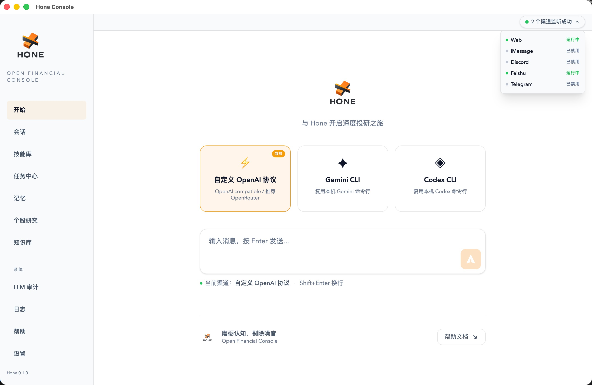
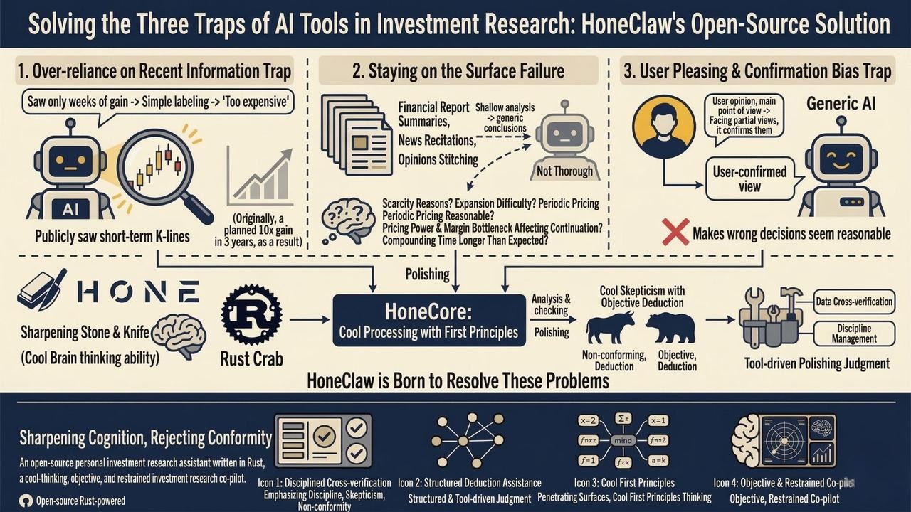
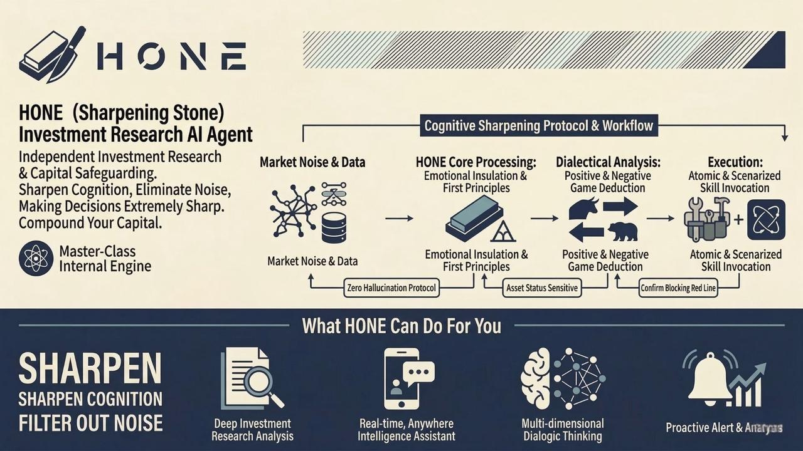
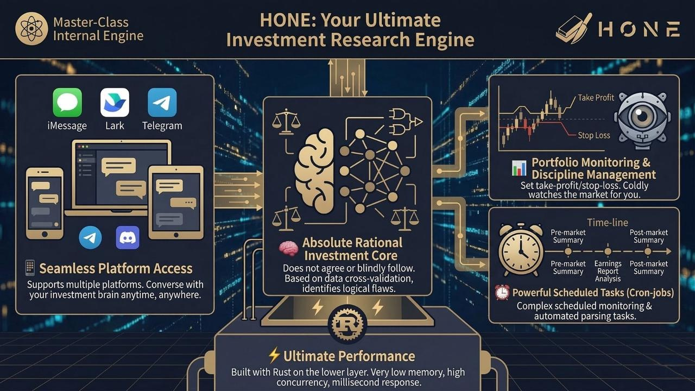
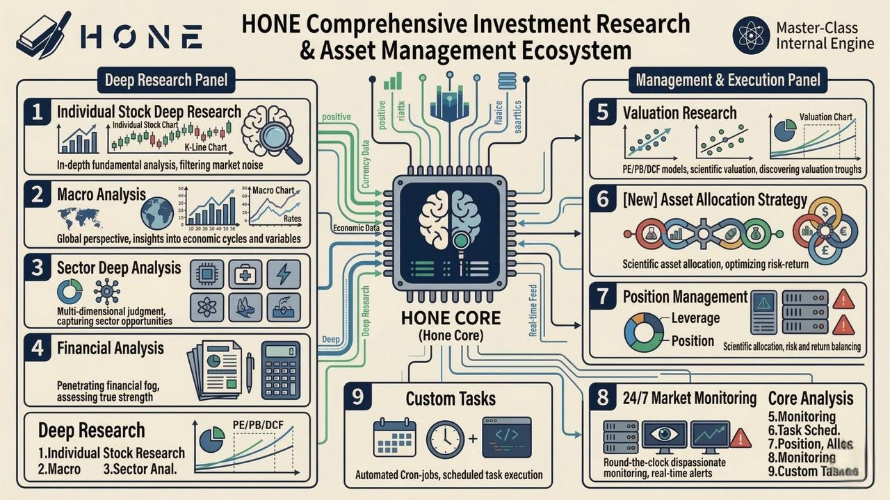
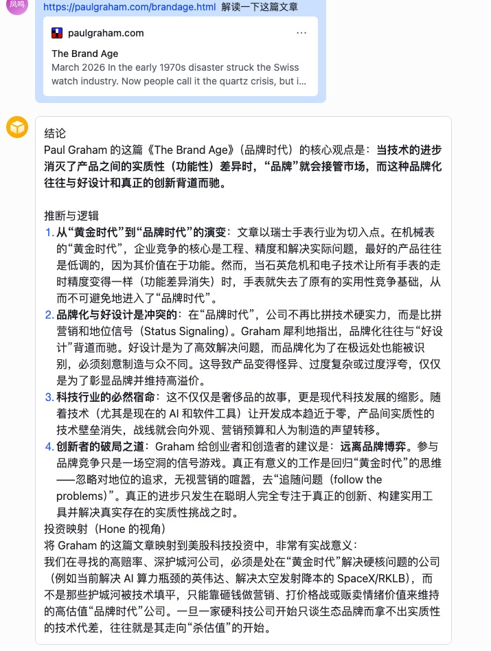
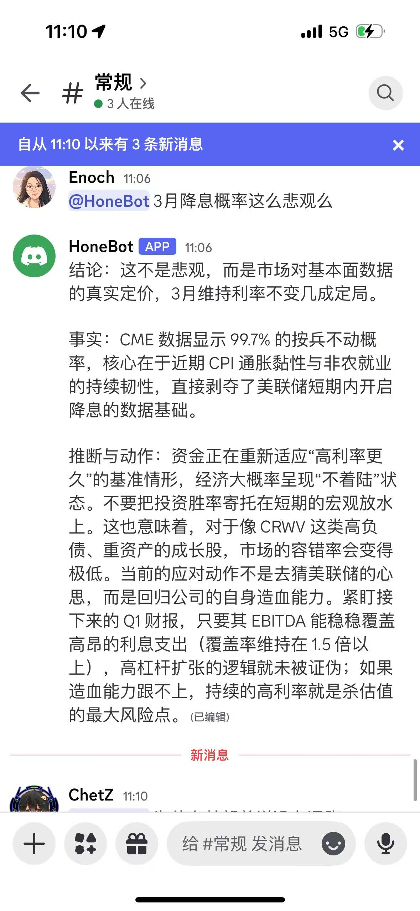
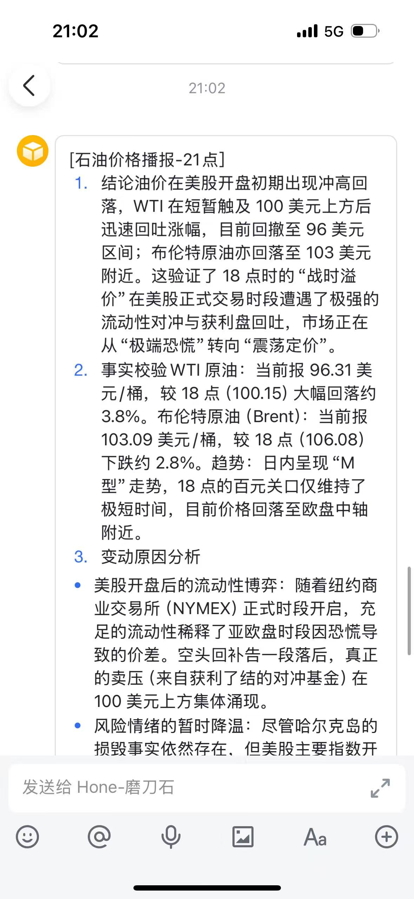

<p align="center">
  
</p>

---

<p align="center">
  <strong>“Not a chat toy designed to indulge you, but a ruthless defender of your investment discipline.”</strong><br>
  <em>HoneClaw is dedicated to being a professional investment assistant that truly understands you.</em>

Why the name Hone:

"Hone" means to sharpen, to refine an edge. And serious investing is fundamentally just that kind of process: it is not about chasing every piece of news, nor reacting emotionally to every rise and fall, but about continuously honing one’s judgment through research, comparison, review, and long-term discipline.

</p>

<p align="center">
  <strong>English</strong> | <a href="./readme.md">简体中文</a> 
</p>

<p align="center">
  <strong>💬 Community:</strong> <a href="https://discord.gg/TyDNfYXDGF" target="_blank">Discord</a> 
</p>

---

# 1. 🦅 Honeclaw (Hone Financial)

Honeclaw (or simply Hone) is an open-source personal investment research assistant written in Rust. Unlike the “chatbots” on the market that are accustomed to agreeing with users, Honeclaw is designed as a co-pilot for investment research that is capable of calm thinking, objective judgment, and disciplined restraint.

<p align="center">
  <a href="./resources/hone_solution.jpg" target="_blank">
    
  </a>
  &nbsp;&nbsp;
  <a href="./resources/hone_introduction.jpg" target="_blank">
    
  </a>
</p>

It integrates into your daily workflow across multiple platforms, helping you track developments at companies you hold, enforce strict investment discipline, run scheduled monitoring tasks, and counter emotional trading impulses with rational data and logic.


# 2. ✨ Key Features


-  🧠 An Absolutely Rational Investment Research Core: It does not flatter and does not follow blindly. When you make investment decisions, it cross-checks them against data and predefined discipline, identifying flaws in your reasoning. 
-  📱 Seamless Cross-Platform Access: Supports iMessage, Lark, Telegram, and Discord, so you can engage with your investment brain anytime, anywhere. 
-  📊 Position Monitoring and Discipline Management: Set your take-profit and stop-loss levels, add-to-position logic, and key indicators to watch, and Hone will monitor the market for you like a cold, vigilant sentinel. 
-  ⏰ Powerful Scheduled Tasks (Cron Jobs): Supports complex scheduled monitoring tasks, such as pre-market briefings, post-market summaries, and automatic analysis after specific earnings releases. 
-  ⚡ Extreme Performance: Built entirely in Rust at the core, with very low memory usage and exceptionally strong concurrent processing capabilities, ensuring millisecond-level responsiveness for messages across multiple platforms.

<p align="center">
  <a href="./resources/hone_channels.jpg" target="_blank">
    
  </a>
  &nbsp;&nbsp;
  <a href="./resources/hone_work.jpg" target="_blank">
    
  </a>
</p>


# 3. 🏗️ Getting Started


## Prerequisites

- **Basic Env**: A basic Unix/Linux environment (macOS / Ubuntu recommended) 
- **Rust**: Edition 2021+

## Installation and Launch

1. Clone the repository
2. 

```shell 
git clone https://github.com/your-username/honeclaw.git
cd honeclaw
```

3. One-click launch

The system includes a built-in launch script that will automatically compile and start the service:

```shell
chmod +x launch.sh
./launch.sh --desktop
```

**🧠 What happens during startup?**

The launch script is more than a one-liner—it **orchestrates the full stack**. On the **first** run it performs the steps below in order (about **10 minutes** end-to-end):

- **Environment detection & sync**: Detects required runtimes such as `bun` and `rustup`, and syncs dependencies.
- **Full build**:
  - **Backend (Rust)**: Builds the desktop shell (`hone-desktop`), core API (`hone-web-api`), and per-channel sidecars.
  - **Frontend (SolidJS / Vite)**: Builds and hot-loads the desktop UI.
- **Service bring-up**: Starts the local web stack and embedded database layer under a supervisor, and opens the desktop window.

**Configuring models and the inference engine**

After the app is up, configure the **brain** for the Agent system.

1. **Open Settings**: Click **⚙️ Settings** in the lower-left of the main window.
2. **Agent basics**: Choose how inference should run:
   - **Local engine (zero config)**: If `gemini cli` or `codex` is already installed and running, Hone can auto-discover it—pick it from the dropdown, no extra wiring.
   - **Cloud (recommended)**: If you prefer not to run a local engine, point Hone at any **OpenAI-compatible** HTTP API.
     - **Suggested pairing**: `OpenRouter` + `Gemini 3.1 Pro/Flash`.
     - **Why**: In our testing, this combo offers the best balance of reasoning depth, latency, and context throughput.


# 4. 🌰 Examples

<table>
<tr>
<th align="center">1. Standard Q&amp;A</th>
<th align="center">2. Discord chat</th>
<th align="center">3. Scheduled briefings</th>
</tr>
<tr>
<td valign="top" align="center"></td>
<td valign="top" align="center"></td>
<td valign="top" align="center"></td>
</tr>
</table>

These screenshots are illustrative only—Honeclaw supports **many more workflows and setups** you can unlock as you go.

[`CASES_EN.md`](CASES_EN.md) collects **real-style Q&A examples** from Hone (single-stock logic, follow-up questions, daily portfolio-aware suggestions, deep dives, scheduled tasks, theme scouting, and macro). They are laid out as a two-column table on GitHub for quick reading.

# 5. 💡 A Note from the Maintainer

“The market is full of noise, and greed and fear are the investor’s greatest enemies. I hope Honeclaw can become your calmest anchor in the trading market.”

To comply with open-source licensing requirements, a number of **professional valuation tools, investment research workflows, and proprietary knowledge bases** are not included in this public repository.

These cover areas such as:

- Advanced DCF and relative-valuation models
- Sector-specific deep-research workflows
- Curated investment research knowledge bases (e.g., earnings transcripts, analyst report libraries)
  
If you are interested in accessing these capabilities, feel free to reach out to us:

1. - [YouTube: 巴芒投研美股频道](https://www.youtube.com/@%E5%B7%B4%E8%8A%92%E6%8A%95%E7%A0%94%E7%BE%8E%E8%82%A1%E9%A2%91%E9%81%93) — follow for investment research content


2. - [Discord](https://discord.gg/TyDNfYXDGF): see the invite link (https://discord.gg/TyDNfYXDGF) to join our community channel


# 6. 🤝 Contributing

Honeclaw is committed to becoming the most professional open-source personal investment research infrastructure in the open-source community. If you are interested in Rust backend development, large language model prompt engineering, or financial data analysis, you are welcome to submit a PR.

Contributors:

- [carlisle0615](https://github.com/carlisle0615)
- [Finn-Fengming](https://github.com/Finn-Fengming)


📄 License

This project is open-sourced under the Apache-2.0 license.