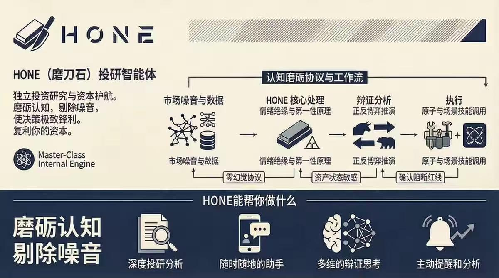
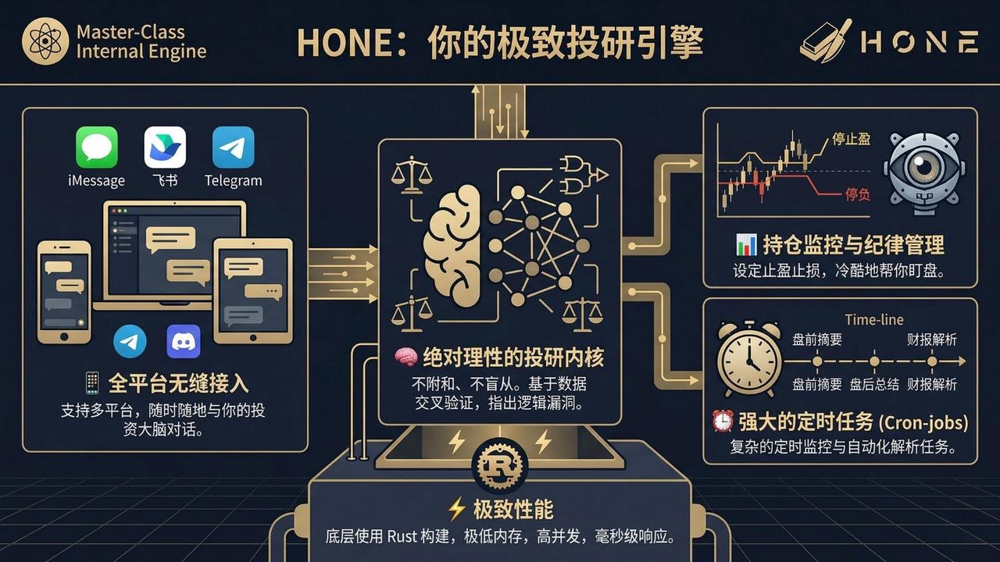
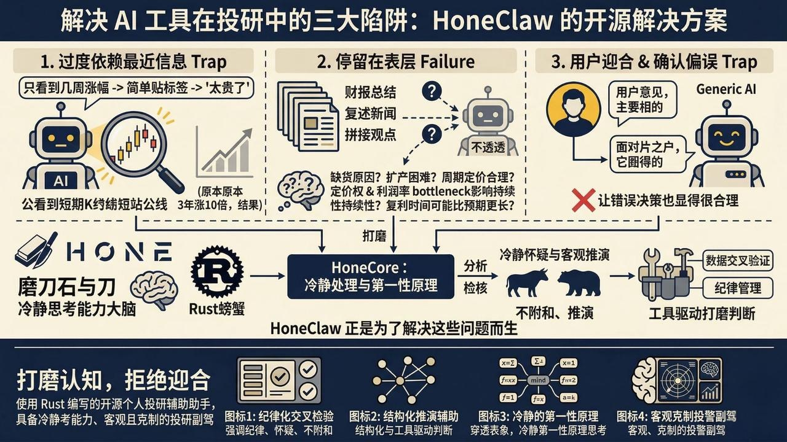

<p align="center">
  
</p>

<p align="center">
  <strong> Hone 磨刀石 </strong><br>
  <strong>“并非迎合你的聊天玩具，而是你投资纪律的无情捍卫者。”</strong><br>
  HoneClaw 致力于成为懂你的、专业的开源投研基础设施。<br><br>
  <strong>为什么取名 Hone：</strong><br>
  Hone 的意思，是磨刀、打磨锋刃。真正严肃的投资，本质上就是这样一个过程：不是追逐每一条新闻，不是对每一次涨跌做情绪化反应，而是在研究、比较、复盘和长期纪律中，不断磨砺自己的判断力。
</p>

<p align="center">
  <strong>简体中文</strong> | <a href="./README.md">English</a> | <strong>官网：</strong><a href="https://hone-claw.com" target="_blank">hone-claw.com</a> | <strong>💬 社群:</strong> <a href="https://discord.gg/TyDNfYXDGF" target="_blank">Discord</a>
</p>

---

# 1. 🦅 Honeclaw (Hone Financial)

Honeclaw（或称 Hone）是一个使用 **Rust** 编写的开源个人投研辅助助手。与市面上习惯于附和用户的“闲聊机器人”不同，Honeclaw 被设计为一个**具备冷静思考能力、客观且克制的投研大脑**。

它通过多端渠道（Web 桌面、飞书、Discord、Telegram、iMessages）无缝接入你的日常工作流，帮助你跟踪持仓公司动态、执行严格的投资纪律、运行自动化监控任务，并在你面对波动产生情绪化交易冲动时，提供理性的数据与逻辑对抗。

用户端官网已上线：**[hone-claw.com](https://hone-claw.com)**。官网从普通用户视角介绍 Hone 是什么、公开聊天如何使用、持仓监控与定时任务如何嵌入日常投研，以及产品路线图、GitHub、Bilibili 和 YouTube 演示入口。

<p align="center">
  
</p>

**系统架构**：[交互式架构图 (HTML)](./resources/architecture.html) — 克隆仓库后，在本地用浏览器打开该文件即可查看。

**完整 Wiki**：[仓库目录、启动方式与排障指南](./docs/wiki.md) — 包含目录说明、运行时布局、安装路径、源码启动模式、端口、配置、验证与常见问题。

# 2. ✨ 核心特性 (Key Features)

- 🧠 **绝对理性的投研内核**：不附和、不盲从。在你做出投资决策时，它会基于数据和预设纪律进行交叉验证，指出你的逻辑漏洞。
- 📱 **全平台无缝接入**：支持 Web 控制台、iMessage、飞书 (Lark)、Telegram、Discord，随时随地与你的投资大脑进行对话。
- 🗂️ **公司画像与长期记忆**：Hone 可以把公司主画像与关键事件时间线持续沉淀为 Markdown 档案，长期保留 thesis、核心经营指标、风险台账与重大变化。
- 📊 **持仓监控与纪律执行**：设定你的止盈止损线、加仓逻辑与核心关注指标，Hone 会像冷酷的守望者一样帮你盯盘并主动提醒。
- ⏰ **强大的定时任务 (Cron)**：支持复杂的定时监控任务，例如盘前摘要、盘后总结、特定财报发布后的自动分析等。
- ⚡ **Rust 驱动的极致性能**：底层完全使用 Rust 构建，确保毫秒级响应速度，同时保持极低的内存占用和极高的稳定性。

<p align="center">
  <a href="./resources/hone_channels_zh.jpg" target="_blank">
    
  </a>
  &nbsp;&nbsp;
  <a href="./resources/hone_solution_zh.jpg" target="_blank">
    
  </a>
</p>

<p align="center">
  <a href="https://hone-claw.com" target="_blank">
    
  </a>
</p>
<p align="center">
  <em>官网：<a href="https://hone-claw.com">hone-claw.com</a> 介绍 Hone 的公开对话、持仓追踪、定时任务、长期公司画像、跨平台通知和产品路线图。</em>
</p>

<p align="center">
  
</p>
<p align="center">
  <em>公司画像（Company Profiles）面板：集中管理研究记忆，同步跟踪从日常聊天中积累的基本面逻辑与投资时间线。</em>
</p>

# 3. 🏗️ 快速开始 (Getting Started)

## 前置依赖

- **运行环境**：类 Unix 环境（推荐 **macOS** 或 **Ubuntu**）。
- **Rust**：**2021 Edition** 及以上工具链。

### 技术栈

- **系统主体**：Rust (Tokio, Axum, SSE)
- **后端**：Rust
- **客户端**（桌面端）：Rust (Tauri)
- **前端**：TypeScript (SolidJS + Tailwind v4)

### 支持渠道

- **Web Console**: 现代化的浏览器交互界面。
- **Mac App**: 原生 macOS 桌面体验。
- **IM 集成**: 飞书 (Feishu / Lark)、Discord、Telegram、iMessage。

## 安装与启动

完整启动矩阵、目录说明、端口、配置和排障请看 [Hone Wiki](./docs/wiki.md)。

### 方案 A：通过 `curl | bash` 安装 (macOS/Linux)

```shell
curl -fsSL https://raw.githubusercontent.com/B-M-Capital-Research/honeclaw/main/scripts/install_hone_cli.sh | bash
hone-cli doctor
hone-cli onboard
hone-cli start
```

### 方案 B：通过 Homebrew 安装

```shell
brew install B-M-Capital-Research/honeclaw/honeclaw
hone-cli doctor
hone-cli onboard
hone-cli start
```

### 方案 C：源码开发模式

```shell
git clone https://github.com/B-M-Capital-Research/honeclaw.git
cd honeclaw
chmod +x launch.sh
./launch.sh --desktop
```

---

# 4. 🌰 典型案例

<table>
<tr>
<th align="center">1. 系统化单股研究</th>
<th align="center">2. Discord 协作对话</th>
<th align="center">3. 自动化定时播报</th>
</tr>
<tr>
<td valign="top" align="center"></td>
<td valign="top" align="center"></td>
<td valign="top" align="center"></td>
</tr>
</table>

[`CASES_ZH.md`](CASES_ZH.md) 汇总了更多**真实场景问答示例**（个股逻辑、每日建议、深度研究、定时任务、宏观等）。

# 5. 💡 维护者寄语

> “市场充满杂音，贪婪与恐惧是投资者的宿敌。希望 Honeclaw 能够成为你在交易市场中最冷静的锚。”

为遵守开源许可要求，一些专业估值工具、专项投研工作流以及付费知识库未包含在此公开仓库中。

如果你有兴趣获取这些进阶能力，欢迎联系我们：

1. [YouTube: 巴芒投研美股频道](https://www.youtube.com/@%E5%B7%B4%E8%8A%92%E6%8A%95%E7%A0%94%E7%BE%8E%E8%82%A1%E9%A2%91%E9%81%93)
2. [BiliBili: 巴芒投资](https://space.bilibili.com/224670487)
3. [Discord 社群](https://discord.gg/TyDNfYXDGF)

# 6. 🤝 参与贡献

我们欢迎任何形式的贡献！无论是 Rust 后端开发、大模型 Prompt 工程还是金融数据分析。

📄 License

本项目采用 MIT 协议。

## Star History

<a href="https://www.star-history.com/?repos=B-M-Capital-Research%2Fhoneclaw&type=date&logscale=&legend=top-left">
 <picture>
   <source media="(prefers-color-scheme: dark)" srcset="https://api.star-history.com/chart?repos=B-M-Capital-Research/honeclaw&type=date&theme=dark&legend=top-left" />
   <source media="(prefers-color-scheme: light)" srcset="https://api.star-history.com/chart?repos=B-M-Capital-Research/honeclaw&type=date&legend=top-left" />
   
 </picture>
</a>
