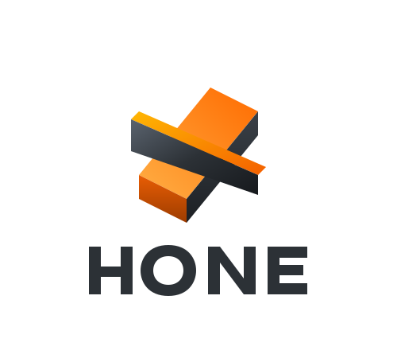
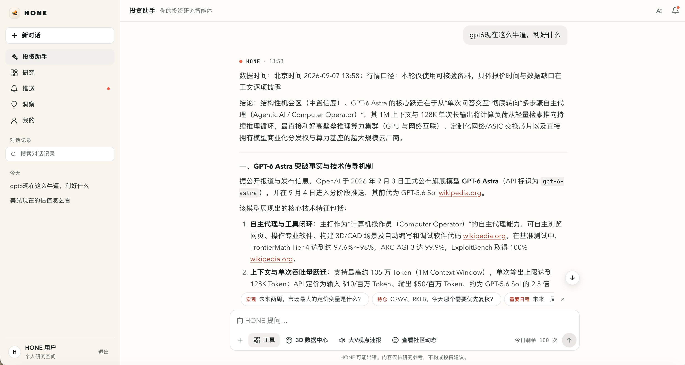
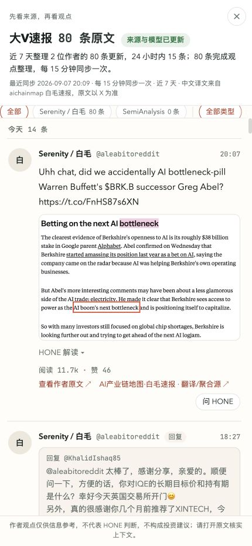

  

<h1 align="center">Hone · 你的 AI 基础设施投研助手</h1>

  从一个问题开始，读懂产业变化，持续跟踪你关心的公司。 
  光通信 · 电力 · 存储 · 芯片 · 数据中心

  <strong>简体中文</strong> · <a href="./README.md">English</a> 
  <a href="https://hone-claw.com/chat">开始使用</a> ·
  <a href="https://hone-claw.com">官网</a> ·
  <a href="https://hone-claw.com/blog">博客</a> ·
  <a href="https://discord.gg/TyDNfYXDGF">Discord 社群</a>

---

**AI 的进步，正在怎样改变你关注的公司？**

新模型发布、推理需求增长、云厂商扩大资本开支，最终会传导到芯片、存储、光互联、电力和数据中心。Hone 帮你把这些变化与具体公司联系起来：用自然语言提问，结合产业研究和专业金融数据理解影响，再把值得持续观察的公司加入关注。

Hone 已围绕**约 50 家 AI 基础设施相关公司**建立本体研究体系，覆盖光、电、存、芯等关键环节。这些积累用于支撑问答中的产业理解与公司分析，让研究能沿着上下游关系深入下去。

  

<em>用户端投资助手：从自然语言问题进入研究，在同一段对话中继续追问。截图为界面示例，内容与数据以使用时的来源为准。</em>

## 把 AI 热点，问成可以继续研究的问题

你不需要先选工具、写提示词模板或整理一份研究提纲。打开投资助手，直接问你关心的事情：

- “推理需求增长，会怎样影响光模块、存储和电力需求？”
- “美光现在的估值怎么看？哪些经营指标值得继续跟踪？”
- “云厂商上调资本开支，对我关注的公司分别意味着什么？”
- “这条消息改变了公司的长期逻辑，还是短期情绪？”

Hone 把 AI 产业背景、公司研究与当前可获取的数据结合起来，帮助你梳理影响路径、关键假设和需要继续验证的问题。你可以沿着回答追问，也可以从研究面板里的「问 HONE」带着上下文继续聊。

## 关注公司，让情报围绕你的研究展开

把关心的公司加入关注或持仓后，你就有了自己的研究起点。公司新闻、财报进展和相关事件，可以放回这些公司的业务与产业背景中理解；重要变化通过用户端推送查看，随后回到投资助手进一步分析。

**Hone 接入专业金融数据库**，支持结合财务报表、增长与盈利指标、现金流、估值和市场数据开展问答。你可以从“发生了什么”，继续问到“对经营有什么影响”“当前估值隐含了什么预期”，以及“下一次应该看什么数据来验证”。

例如，关注一家存储公司后，可以围绕价格周期、产能、利润率和资本开支持续提问；关注一家光通信公司，则可以沿着产品升级、客户需求与交付节奏跟踪变化。

数据覆盖和更新频率取决于对应数据源；可用功能也取决于账户权限与服务配置。

## Serenity 等大 V 动态，在手机上及时看

在「研究 → 大V速报」中，快速浏览 Serenity（白毛）等已接入作者的公开动态。当前线上速报**每 15 分钟同步一次**，把分散的信息整理到同一条时间线，方便你利用碎片时间跟上产业讨论。

- 阅读中文译文，按需展开英文原文，查看配图与发布时间。
- 打开作者原文和翻译／聚合来源，核对完整上下文。
- 展开「HONE 解读」，进一步理解观点与事实的区别，再通过「问 HONE」继续研究。

  

<em>线上用户端的手机视口实拍。作者观点、原文与 HONE 解读分别呈现；作者观点不代表 Hone 判断。</em>

## 看宏观红绿灯，更看它如何影响 AI 基础设施

宏观红绿灯帮助你观察大盘与经济周期，了解金融条件和市场风险的变化，并查看判断依据。你可以先看信号，再打开详情，或直接追问背后的原因。

**Hone 更关注这些变化如何传导到 AI 基础设施本身。** 利率、流动性和风险偏好的变化，要进一步放回融资成本、云厂商资本开支、数据中心建设与上游需求中理解。研究中也结合 AI 需求、商业化、融资与资本开支等维度，观察产业增长的持续性。

“今天是什么灯”是入口。更值得追问的是：这次变化会影响谁、通过什么路径影响、公司基本面是否也发生了变化，以及还需要哪些证据。

## 从今天开始使用

1. 打开 **[Hone 用户端](https://hone-claw.com/chat)**，按页面提示登录，提出你的第一个 AI 或公司研究问题。
2. 添加你关注的公司或持仓，让后续情报有明确的研究对象。
3. 在「研究」查看宏观红绿灯和大V速报，在「推送」查看与自己相关的更新。
4. 遇到值得深挖的信息，点击「问 HONE」，回到对话中继续分析。

浏览器即可使用，电脑适合深入研究，手机适合查看动态和随时追问。

## 开源与自部署

Honeclaw 是 Hone 的开源项目，采用 **Rust + SolidJS / TypeScript**，提供对话、研究、通知与多端接入的应用基础。希望了解实现、参与开发或自部署，可以从以下文档开始：

- [完整 Wiki：安装、配置、启动与排障](./docs/wiki.md)
- [代码库地图与模块入口](./docs/repo-map.md)
- [开发与协作约定](./AGENTS.md)
- [Releases 与安装包](https://github.com/B-M-Capital-Research/honeclaw/releases)

线上产品接入的专业金融数据库、专有本体研究与部分研究资产，不随公开代码一并提供。自部署需要自行配置模型与数据服务；克隆仓库不等于获得线上服务的全部数据和权限。

欢迎通过 [Issues](https://github.com/B-M-Capital-Research/honeclaw/issues)、Pull Request 或 [Discord](https://discord.gg/TyDNfYXDGF) 反馈问题、分享使用体验和参与贡献。更多内容见 [Bilibili：巴芒投资](https://space.bilibili.com/224670487) 与 [YouTube：巴芒投研美股频道](https://www.youtube.com/@%E5%B7%B4%E8%8A%92%E6%8A%95%E7%A0%94%E7%BE%8E%E8%82%A1%E9%A2%91%E9%81%93)。

Hone 意为打磨。我们希望它帮助你在持续研究、比较与复盘中，磨砺自己的判断力。

本项目采用 [MIT License](./LICENSE)。Hone 的内容仅供研究参考，不构成投资建议。
