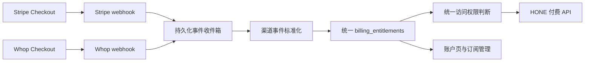

# Stripe + Whop 并行计费接入计划

- title: Stripe + Whop 并行计费接入
- status: `in_progress`
- created_at: `2026-08-03`
- updated_at: `2026-08-04`
- owner: `Codex`
- related_files:
  - `memory/src/{billing,web_auth}.rs`
  - `crates/hone-core/src/cloud_runtime.rs`
  - `crates/hone-web-api/src/routes/{billing,stripe,whop,public}.rs`
  - `packages/app/src/pages/{public-activate,public-me,public-plan}.tsx`
  - `packages/app/{playwright.config.ts,e2e/public-billing-activation.spec.ts}`
  - `tests/regression/{ci,manual}/test_*billing*.sh`
- related_docs:
  - `docs/current-plan.md`

## Goal

按从 Codex 持久化会话中逐字复制的原始方案推进 Stripe 与 Whop 并行接入，不在落盘时重写方案。

## Scope

下方标记区间是会话中上一条 assistant 输出的原文，执行范围以该原文为准。

## Architecture Override

- 2026-08-03 用户明确要求“架构要优雅，允许重构，不要兼容”。本节优先于下方原始方案中关于“双读旧字段”“暂时保留 `whop_membership` 一版”和旧路由兼容的建议。
- 实现采用一次性迁移：旧 Whop 投影完整迁入 provider-neutral Billing 账本后删除旧运行时字段与专用访问判断，不保留长期兼容层。
- 身份、Billing 存储、访问策略和 Stripe/Whop provider adapter 分层；Billing 账本是唯一会员权益真相源。
- 旧 `/activate/whop` 与旧 `whop_membership` API 字段直接移除，仓库内调用方一次性迁到统一 `/activate` 与统一权益模型。

## Validation

- 落盘验证：标记区间正文与持久化 JSONL 中目标 `assistant/output_text` 做逐字节 SHA-256 比对。
- 原文 SHA-256：`ed8f9c9024d6dfe3a8a740f1c32049dfeb5bef98f8d6d68715c0df16a243aeb6`。
- Rust 定向验证：Billing `5/5`、Stripe `7/7`、Whop `2/2`、迁移与邮箱限流测试通过，`cargo check -p hone-web-api --all-targets` 通过；Webhook 收件箱另有租约过期重领与 attempt fencing 回归证明，Checkout 幂等键覆盖稳定重试、状态变化后重购与跨日重建。Stripe 新回归覆盖真实 provider 顺序：`checkout.session.completed` envelope 可以晚于 invoice/subscription，但 provisional pending 按 Session creation 排序，不再压住已付款事件。同一 provider 重购后，旧订阅的迟到失效事件不会撤销新订阅，且所有权益都失效后才拒绝访问，已有独立回归证明。
- 仓库级验证：`cargo check --workspace --all-targets --exclude hone-desktop --exclude hone-user-app`、对应完整 `cargo test`、`bash scripts/ci/check_fmt_changed.sh` 均通过；仅有既存的 `feishu_direct_actor_contact_targets_from_records` dead-code warning。
- Web/Worker 验证：Web `352/352`、`bun run typecheck:web`、`bun run build:web:public` 通过；Public Community Edge Worker typecheck 与 `45/45` 测试通过。
- 回归门禁：`tests/regression/ci/test_billing_contract.sh` 与新增的 `test_billing_http_e2e.sh` 全部通过。后者启动隔离真实后端，以临时 SQLite 和假测试密钥执行 Stripe/Whop 原始签名 HTTP webhook，覆盖 `pending/402`、付款激活、重放、乱序、错误目录、失败宽限、恢复、周期结束取消、删除、双 provider、全部失效与重购；不读取仓库 `.env`、不访问外部账号。Billing 合同现有 `rg`/`grep` 等价分支，已在刻意移除 `rg` 的 `PATH` 下通过。Secret Scan 只对两条精确的既有支付宝参考资产历史指纹放行；完整历史扫描为 0，完整假 RSA 私钥负向控制仍被 `private-key` 规则检出，没有泛化关闭规则。
- 视觉验收：已用实际 Vite 页面与隔离后端 fixture 在浏览器打开 `/plan`、`/activate`、`/me`，并检查 390×844 的 HONE-iOS 购买隔离状态。发现并修复 iOS 恢复页错误显示“Stripe 付款”步骤；后续审计又发现 `/me` 仍暴露外部账单管理入口，已拆分服务端购买/管理策略并 fail-closed 隐藏。最终 `/me` 截图证明 Stripe/Whop 状态和重复订阅警告可见、外部管理动作为空且横向溢出为 `0`。
- 去敏截图目录：`/Users/bytedance/.codex/visualizations/2026/08/03/019fc5c7-d3a5-7df1-83fc-5f0826ad4519/stripe-billing-acceptance/`；本地/沙箱证据为 `01`–`12`，生产在线验收为 `13-production-webhook-delivery-200.png`、`14-production-plan-safe-stage.png`、`15-production-activate-safe-stage.png`、`16-production-me-unauthenticated.png`、`17-production-whop-reactive-route.png`。
- Stripe 沙箱进度：owner 已在操作发生前确认；测试模式已创建独立 Product `prod_V0J9fIdOhCrS4z` 与年度 Price `price_1U0IXPEK7h1dD4JHHavBWqmr`，页面证明名称、US$199.99、USD、每年、无试用且 live catalog 未改。测试 Customer Portal 已保存为配置 `bpc_1U0IZEEK7h1dD4JHxYx1GhDy`：允许更新支付方式、周期结束取消，禁止切换方案/改数量，返回 `https://hone-claw.com/me`。
- Stripe CLI 与真实付款：已通过官方 Homebrew tap 安装 `stripe 1.45.0`，owner 已亲自完成验证器挑战与配对授权，`stripe login list` 显示活动 profile `HoneClaw`。本机忽略的 `.env` 已保存 test secret；`tests/regression/manual/test_stripe_billing_sandbox.sh` 通过真实账户目录核验。Codex 经 owner 明确授权填写 Stripe 公共测试卡并提交 US$199.99/年测试订阅，CLI listener 将 `checkout.session.completed`、`invoice.paid`、`customer.subscription.created` 各投递一次且后端均返回 `202`。真实事件暴露 provisional ordering 缺陷；修复后，同一批真实事件经新签名 endpoint 重放后全部 `processed/attempt_count=1`，只生成 1 条 `active` 权益，付费 API 从 `402` 变为 `200`。测试 Customer Portal 实际显示支付方式更新、周期结束取消和已付账单；未执行取消。
- 真实 Stripe 全生命周期：新增 opt-in `tests/regression/manual/test_stripe_billing_lifecycle.sh`，使用隔离 HONE 后端、临时 SQLite、一次性错误目录 Product/Price 和 Stripe Test Clock，真实创建 Checkout/Portal、付费订阅、续费失败、有限宽限、账单恢复、周期结束取消、立即终止与新订阅重购。最终 13 条真实 Stripe webhook 均 `processed`、`attempt_count=1`、无错误，权益为 1 条 active + 1 条 inactive，付费 API 完成 `402 → 200 → 402 → 200`；Test Clock 删除全部 customer/subscription，对应 Price/Product 已归档，未留下活跃测试对象。
- Webhook 环境边界：本地 `stripe listen` 临时 secret、线上注册 test endpoint secret、线上注册 live endpoint secret 必须分开；API path 可相同，但 host/部署和 secret 不同。线上 test endpoint 已创建；其旧 signing secret 因意外暴露已立即轮换并失效，新值已受保护安装到生产并完成在线 delivery 验收。任何文档、日志和截图均不得记录新值。

## 2026-08-04 安全部署与在线验收

- `5028870dcb341476e17b57fdfa84d72624b04200` 已由唯一部署负责人切换到生产；`/api/meta` 证明 `cloud_mode=cloud`、`runtime_role=web`、PostgreSQL 与 S3/OSS 健康、`cloud_storage_authoritative=true`、`local_durable_dependency_count=0`。
- 轮换后的 test endpoint secret 仅写入受保护的 `/etc/hone/runtime.env`；备份为 `/etc/hone/runtime.env.pre-webhook-rotation-20260804T034309Z`，原文件继续保持 `root:root 0600`。切换前两次 active-chat 均为 `{"count":0}`，只重启 `hone-web.service`，未触碰 Feishu 或其它服务。
- 生产安全阶段配置保持 `primary_provider=whop`、`stripe_checkout_enabled=false`、`whop_new_purchases_enabled=true`。这不是最终渠道策略；原始方案的最终方向仍是新用户默认 Stripe、Whop 作为老用户/次级渠道。
- 公网无效签名返回 `401`。Stripe 测试事件 `evt_1U0ZKeEK7h1dD4JHB59OFEjY` 经注册 endpoint 返回 `200 catalog_mismatch`；`billing_entitlements` 与 `billing_webhook_events` 在投递前后均为 0，证明线上验签可用且错误目录无授权副作用。
- 生产验收发现 `/activate` 组件只在首次加载读取 `window.location.search`，导致从 Stripe 页面同路由点击 `?provider=whop` 后仍显示 Stripe，刷新才恢复。`e31c29ac` 改用 Solid Router 的响应式 search params，所有 provider 分支由同一 memo 派生，并加入 Playwright 回归覆盖“无需刷新即切换”。Web 全量测试、typecheck、生产构建和定向 E2E 均通过。
- 后续直接打开生产 `/activate` 又发现服务端已关闭 Stripe Checkout、主渠道为 Whop 时，缺少 query 的页面仍默认展示 Stripe 表单。激活 provider 现统一由纯策略函数按 router query + 服务端 Billing config 解析：显式 Whop 始终用于恢复，显式 Stripe 仅在 Checkout 开启时生效，缺省或 stale Stripe URL 在关闭状态下 fail closed 到 Whop。配置返回前仅显示中性“正在确认会员渠道”，不渲染邮箱/验证码输入；加载失败给出单一“重新加载”动作。单元、合同和 scoped Playwright `3/3` 均覆盖该矩阵。
- 额外运行仓库全套 Playwright 时，Billing `3/3` 持续通过；全套仍有 7 条非 Billing 的 admin/company-profile/chat-upload/mobile-overlay/SMS 用例失败，单 worker 串行可复现。本次未改对应业务页面或 fixtures，且 E2E 不在默认 CI 契约内；该结果不冒充全仓 E2E 全绿，留给对应活跃任务处理。
- live mode、live Product/Price、live webhook、Stripe Checkout、税务与真实订阅取消均未触碰。

## Completion Audit

| Requirement | Current evidence | Status |
|---|---|---|
| provider-neutral Billing 为唯一权益真相源，无长期兼容层 | SQLite/PostgreSQL schema、启动时一次性 Whop 投影迁移、旧字段/路由合同扫描 | `complete` |
| Stripe/Whop 任一有效即授权，只在全部失效后拒绝 | Billing `canceling_one_provider_*` 与 `old_subscription_events_*` 回归，后端统一 `user_has_product_access` | `automated_complete` |
| 重复、乱序、租约恢复与旧 worker fencing | Billing inbox 回归、Stripe/Whop adapter 测试、隔离签名 HTTP 生命周期 | `automated_complete` |
| Checkout 由服务端锁定目录，成功跳转不授予权益 | Checkout/normalization 代码、Stripe 单元测试、隔离 HTTP 的 `pending/402` 与 Origin/iOS 拒绝 | `automated_complete` |
| Test Product/Price 与 Customer Portal 配置 | Stripe 测试模式页面与去敏截图 `08`、`09` | `external_complete` |
| iOS 隐藏价格、外部购买与账单管理入口，仅保留登录/恢复/状态 | 自动化合同、服务端 User-Agent 策略与 390×844 `/plan`、`/activate`、`/me` 截图 `04`、`04b`、`05`、`10` | `external_complete` |
| Stripe 成功/取消/失败/恢复/到期/重购、签名重放与错误目录 | 真实 listener、Checkout 公共测试卡付款、active 权益、Portal 与签名重放已通过；opt-in Test Clock 回归处理 13 条真实 Stripe 事件并完成失败/恢复/取消/重购，且清理全部一次性对象；注册 test endpoint 的轮换 secret 已安装，线上错误目录事件返回 `200 catalog_mismatch` 且无数据库副作用 | `external_test_complete` |
| 现有 Whop 购买邮箱、激活、续费/取消和重购链路零回归 | 迁移、adapter、前端合同与隔离真实 HTTP 生命周期已完成；非 owner 真实买家验收尚未跑完 | `pending_external` |
| 税务、退款、账单描述、客服与争议口径 | 仅记录风险；live promotion 前需要 owner 明确批准 | `pending_owner_before_live` |

## Documentation Sync

- 已更新 `docs/current-plan.md`、`docs/repo-map.md`、`docs/invariants.md`、`docs/decisions.md`、Stripe/Whop runbook 与进行中 handoff。
- 当前状态保持 `in_progress`：精确后端部署、test endpoint secret 轮换/安装、线上无副作用 delivery、Stripe 真实测试生命周期、Whop 同路由恢复和服务端 provider policy 均已完成；非 owner Whop buyer、当前提交 GitHub CI 与 live promotion 决策仍待完成，因此不归档。

## Risks / Open Questions

- Stripe CLI OAuth、真实测试目录、listener、测试付款、Portal、active 权益和注册 test endpoint 的线上 delivery 均已通过。本地 listener、线上 test、未来 live endpoint 仍必须使用各自独立 secret；live endpoint、live secret、live Product/Price 与现有 live catalog/config 均未改动。
- 税务、退款、账单描述、客服与争议口径仍需 owner 在 live promotion 前批准；Stripe Tax 继续关闭不影响沙箱验证。
- 会话持久化路径属于本机证据，不写入仓库正文；仅保存原始输出内容及其校验结果。

## Resume Entry Point

1. 推送当前 CI/生命周期/provider-policy 修复并跟踪 GitHub workflow 至绿色；若出现本改动相关失败，继续修复，不把排障步骤交给 owner。
2. 由真实非 owner Whop buyer 本人完成购买邮箱验证码，以闭合现有 Whop 生产激活与重购验收；Codex 负责其余导航、观察和证据留存。
3. owner 在 live promotion 前确认税务、退款、账单描述、客服和争议口径；随后按受控顺序切换新用户默认 Stripe。沙箱完成不自动授权 live 上线。

## 持久化会话原始方案

<!-- BEGIN_VERBATIM_CODEX_OUTPUT -->
# Stripe + Whop 并行完整方案

结论：可以并行。最稳妥的上线方式是：

- 现有 Whop 用户继续续费，不强制迁移。
- 新用户默认走 Stripe。
- Whop 保留为可选购买渠道，或仅供老用户管理。
- HONE 自己维护统一会员权益，不能让 Stripe/Whop 各自直接决定访问权限。

默认商品保持一致：`B&M Research Membership — Full Access`、`US$199.99/年`、无试用期。

## 1. 推荐业务模式

建议采用“迁移式并行”，而不是永久放两个同级购买按钮：

| 用户 | 默认处理 |
|---|---|
| 已有 Whop 有效会员 | 继续 Whop，不提示 Stripe 购买 |
| 新用户 | 默认 Stripe Checkout |
| 希望使用 Whop 的新用户 | 提供次级 Whop 入口 |
| 两边都已订阅 | HONE 仍然可用，但账户页明确提示重复订阅 |
| 取消其中一个渠道 | 只要另一个仍有效，就不撤销 HONE 权限 |
| 两边都失效 | 保留账号和账单页访问，付费功能返回 `402` |

Stripe 自带的重复订阅限制只能识别 Stripe 内部订阅，发现不了 Whop 会员，因此跨平台防重复必须由 HONE 完成。[Stripe 重复订阅限制说明](https://docs.stripe.com/payments/checkout/limit-subscriptions)

## 2. 总体架构



核心原则是：

```text
HONE访问权限 =
国内有效邀请
OR 任意一条有效Whop权益
OR 任意一条有效Stripe权益
```

不能继续用 `registration_policy` 直接判断权限。当前实现只有 Whop 专用字段，而且未知渠道会默认通过，[前端权限判断](/Users/bytedance/Codes/honeclaw/packages/app/src/lib/public-membership.ts:18)和[后端权限判断](/Users/bytedance/Codes/honeclaw/memory/src/web_auth.rs:1104)都必须重构。

## 3. 数据模型

新增两张核心表，在 SQLite 和云端 PostgreSQL 都实现。

### `billing_entitlements`

每条外部订阅对应一条记录：

- `entitlement_id`
- `user_id`
- `provider`: `whop | stripe | domestic_invite`
- `provider_customer_id`
- `provider_subscription_id`
- `provider_product_id`
- `provider_price_id`
- `purchase_email_normalized`
- `raw_status`
- `access_state`: `pending | active | grace | inactive`
- `current_period_start`
- `current_period_end`
- `cancel_at_period_end`
- `last_event_id`
- `last_event_created_at`
- `created_at`
- `updated_at`

约束：

- 唯一键：`(provider, provider_subscription_id)`
- 索引：`user_id + access_state`
- 索引：规范化购买邮箱
- 同一用户可以同时拥有 Whop 和 Stripe 权益
- 旧订阅事件不得覆盖较新的重新购买记录

### `billing_webhook_events`

作为持久化事件收件箱：

- `provider`
- `event_id`
- `event_type`
- `object_id`
- `payload_sha256`
- `provider_created_at`
- `processing_state`
- `attempt_count`
- `last_error`
- `received_at`
- `processed_at`

唯一键为 `(provider, event_id)`，用于防止重复处理。只保留必要的标准化字段和载荷摘要，避免长期保存完整个人信息。

## 4. 账号与购买流程

不建议使用裸 Payment Link；应使用服务端创建的 Stripe Checkout Session，这样才能绑定 HONE 用户、检查重复订阅并控制商品。

推荐流程：

1. 用户点击“使用 Stripe 订阅”。
2. 进入统一的 `/activate` 页面，填写邮箱并完成 HONE 邮箱验证码。
3. 创建或登录一个“尚未付费”的 HONE 账号。
4. 后端检查该用户是否已有有效 Whop/Stripe 权益。
5. 已有权益：不创建新 Checkout，直接显示对应订阅管理入口。
6. 没有权益：后端创建 Stripe Checkout Session。
7. Session 只使用服务端配置的 Price ID；前端不得提交金额或商品 ID。
8. 将内部 `user_id` 放进 Stripe `client_reference_id` 和服务端生成的 metadata。
9. 付款后进入 `/me?checkout=processing`。
10. 页面等待 webhook 同步，再显示“会员已开通”。

不能根据成功跳转 URL、查询参数或前端状态开通权限。Stripe 明确要求用 webhook 完成履约，因为付款成功后用户未必会访问成功页。[Stripe 成功页与 webhook 要求](https://docs.stripe.com/payments/checkout/custom-success-page)

Whop 可以保留现有“购买邮箱 + HONE 验证码”逻辑，但最终也写入统一权益表。

## 5. Stripe webhook

新增：

```text
POST /api/public/integrations/stripe/webhook
```

首批监听事件：

- `checkout.session.completed`
- `checkout.session.async_payment_succeeded`
- `checkout.session.async_payment_failed`
- `invoice.paid`
- `invoice.payment_failed`
- `customer.subscription.created`
- `customer.subscription.updated`
- `customer.subscription.deleted`

处理规则：

- `checkout.session.completed`：建立用户、Customer、Subscription 的关联。
- `invoice.paid`：首次开通或延长有效期。
- `invoice.payment_failed`：进入宽限状态，账户页提示更新付款方式。
- `cancel_at_period_end=true`：保持访问至当前周期结束。
- `deleted/canceled/unpaid/incomplete_expired`：撤销该条 Stripe 权益。
- 只撤销对应渠道，不影响另一条有效权益。

Stripe webhook 必须：

- 使用未经解析的原始请求体验签。
- 校验 `Stripe-Signature` 和时间窗口。
- 只接受正式配置的 Product/Price。
- 按 Event ID 去重。
- 不依赖事件送达顺序。
- 先持久化并快速返回，再异步处理。

Stripe 官方说明事件可能重复、乱序，并建议异步处理。[Stripe webhook 安全与可靠性规范](https://docs.stripe.com/webhooks)

## 6. 权益状态策略

推荐默认映射：

| Stripe 状态 | HONE 权益 |
|---|---|
| `active`、`trialing` | `active` |
| `past_due` | `grace` |
| `cancel_at_period_end` | 到期前 `active` |
| `incomplete` | `pending` |
| `unpaid`、`canceled`、`paused`、`incomplete_expired` | `inactive` |

建议宽限期设为可配置的 7 天；到期或 Stripe 最终标记为无效后撤权。首次开通最好以 `invoice.paid` 为准，避免异步支付尚未到账就授予权限。[Stripe 订阅生命周期](https://docs.stripe.com/billing/subscriptions/webhooks)

Whop 第一阶段保持现有状态语义，避免影响老用户；之后再统一宽限政策。

## 7. 新增后端接口

```text
POST /api/public/billing/checkout/stripe
GET  /api/public/billing/status
POST /api/public/billing/portal/stripe
GET  /api/public/billing/entitlements
POST /api/public/integrations/stripe/webhook
```

要求：

- 创建 Checkout 和 Portal 必须是服务端操作。
- Cookie 登录接口需要严格 Origin/CSRF 检查。
- Stripe Secret Key 永不进入浏览器。
- Stripe 客户门户链接按需创建，不持久化短期 URL。[Stripe Customer Portal](https://docs.stripe.com/customer-management/integrate-customer-portal)
- API 返回统一权益模型，并暂时保留旧 `whop_membership` 字段一版，保证升级兼容。

## 8. 前端调整

主要涉及：

- [public-plan.tsx](/Users/bytedance/Codes/honeclaw/packages/app/src/pages/public-plan.tsx)
- [public-whop-activate.tsx](/Users/bytedance/Codes/honeclaw/packages/app/src/pages/public-whop-activate.tsx)
- [public-me.tsx](/Users/bytedance/Codes/honeclaw/packages/app/src/pages/public-me.tsx)
- [public-membership.ts](/Users/bytedance/Codes/honeclaw/packages/app/src/lib/public-membership.ts)
- `packages/app/src/lib/api.ts`
- `packages/app/src/lib/types.ts`
- `packages/app/src/app.tsx`

页面变化：

- `/plan`：Stripe 为主按钮，Whop 为次级入口。
- `/activate`：统一邮箱验证，不再写成 Whop 专用页面。
- `/me`：逐条显示 Stripe/Whop 订阅、状态、到期日和管理入口。
- 双订阅时显示醒目提示，但不自动取消任何一边。
- 付款完成页显示“正在确认付款”，而不是立即显示已开通。
- 失败、取消、宽限期都提供明确恢复路径。

## 9. iOS 边界

当前 iOS 客户端把 `hone-claw.com` 路由继续留在 WKWebView 内，[HONEWebView.swift](/Users/bytedance/Codes/honeclaw/apps/hone-ios/HONE/HONEWebView.swift:45)，因此 `/plan` 的外部购买入口也可能出现在 App 内。

HONE 是解锁数字功能的服务。Apple 当前规则在美国以外的许多 storefront 对外部购买入口仍有限制。[Apple App Review Guidelines 3.1](https://developer.apple.com/app-store/review/guidelines/)

最安全方案：

- 检测现有 `HONE-iOS` User-Agent。
- iOS App 内隐藏价格、Stripe/Whop 购买按钮和外部购买号召。
- App 内只允许登录、恢复已有权益和查看订阅状态。
- 公共浏览器网站正常展示 Stripe/Whop。
- 如果未来要在 iOS 内销售，再单独评估 StoreKit 或适用 entitlement。

## 10. 税务、退款与运营

普通 Stripe Payments 下，Snowdrift Capital LLC 通常是直接交易的 Merchant of Record，需要承担适用的税务、退款和争议责任；这与 Stripe Managed Payments 不同。[Stripe Merchant of Record 说明](https://stripe.com/resources/more/merchant-of-record)

Whop 是否代收代缴取决于具体 Tax Mode 和销售类型。[Whop 税务说明](https://docs.whop.com/payments-and-billing/fees/taxes)

正式开放前必须确定：

- 销售地区和税务注册义务。
- Stripe Tax 是否启用。
- 价格是否含税。
- 退款政策。
- 付款失败宽限期。
- Stripe 与 Whop 的账单描述、客服和争议流程。

Stripe Tax 当前建议继续关闭，直到税务口径明确；开发和沙箱测试不受影响。

## 11. 条款和隐私政策

现有文案明确写着“海外付款由 Whop 处理”，例如 [public-content.ts](/Users/bytedance/Codes/honeclaw/packages/app/src/lib/public-content.ts:3201)，上线 Stripe 前必须同步：

- 增加 Stripe 作为付款和订阅处理方。
- 声明保存 Stripe Customer、Subscription、Invoice、Event 等标识。
- 明确不接收或保存完整银行卡号。
- 写明自动续费、取消生效时间、退款规则和税费。
- 将协议版本从 `2.2` 升级，并让用户重新确认。

## 12. 实施阶段

### 阶段一：统一权益层

- 新增数据表和 provider-neutral 类型。
- 迁移现有 Whop 记录。
- 双读旧字段与新表。
- 权限改为“任一有效权益”。
- 暂不改变购买入口。

### 阶段二：Stripe 沙箱

- 在 Stripe 沙箱创建同名测试产品和价格。
- 接 Checkout Session、webhook、Portal。
- 完成支付成功、失败、取消、续费和乱序测试。
- 不使用刚创建的正式产品进行开发测试。

### 阶段三：前端与合规

- 上线统一激活页和账户页。
- 更新条款、隐私和购买说明。
- 加 iOS 购买入口隔离。
- 全部放在功能开关后。

### 阶段四：正式灰度

- 先完成一笔明确授权的真实小范围验收。
- 核对付款、webhook、权益、Portal、取消和银行入账。
- 仅向少量新用户开放 Stripe。
- Whop 老用户不受影响。

### 阶段五：默认 Stripe

- 新用户默认 Stripe。
- Whop 新购买入口降为次级或关闭。
- 连续观察至少一个完整的失败付款/取消流程后再扩大。

## 13. 测试与验收

必须覆盖：

- Stripe/Whop 任一有效即可访问。
- 取消一边不会撤销另一边权限。
- 两边失效才返回 `402`。
- 成功跳转不能伪造权益。
- 错误 Product/Price 不授予权限。
- 重复、乱序和旧 webhook 不改变最新状态。
- 同邮箱双订阅能识别并提示。
- 支付失败、恢复付款、到期取消、重新购买。
- 旧 Whop 用户零回归。
- iOS 内看不到外部购买入口。

验证执行仓库现有完整 CI，并增加一个无需真实账号的 Stripe webhook 回归脚本；真实 Stripe CLI、沙箱和正式支付验收放在 `tests/regression/manual/`，不进入默认 CI。

## 14. 灰度与回滚

至少保留这些开关：

```text
HONE_STRIPE_CHECKOUT_ENABLED=false
HONE_BILLING_PRIMARY_PROVIDER=whop|stripe
HONE_WHOP_NEW_PURCHASES_ENABLED=true|false
```

回滚时：

- 立即关闭新 Stripe Checkout。
- 继续接收 Stripe webhook，不能让已付款用户失联。
- 不删除 Stripe 产品、客户或订阅。
- Whop 购买和现有权益继续工作。
- 数据库迁移只向前兼容，不执行破坏性回滚。

这套方案属于中大型跨模块改造。正确顺序是：先统一权益层，再接 Stripe 沙箱，最后才开放正式 Checkout。
<!-- END_VERBATIM_CODEX_OUTPUT -->
