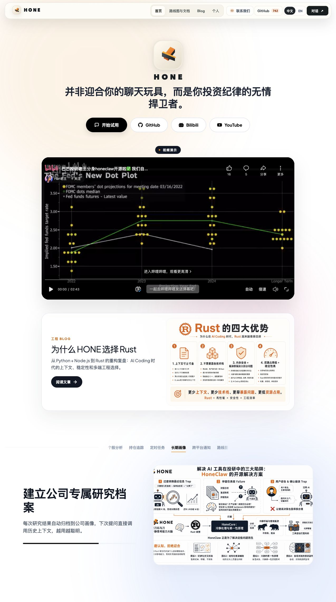
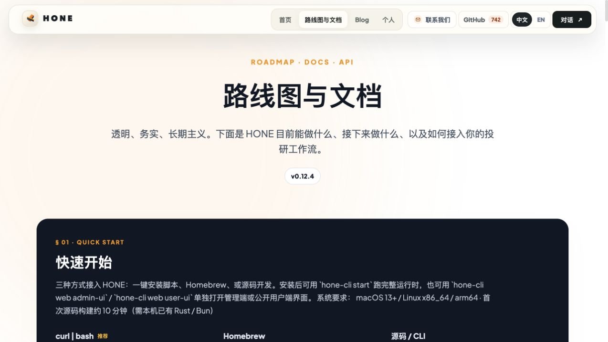
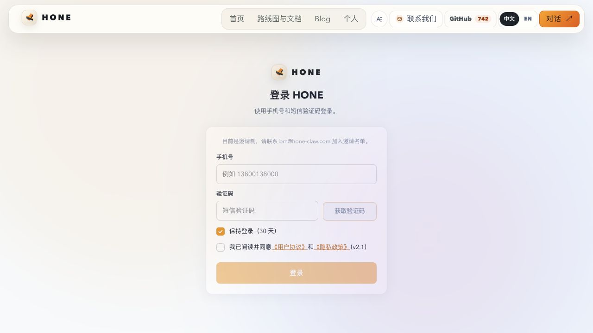

# 公开用户端与核心旅程

## 1. 官网：先建立产品信念，再导向使用

首页当前采用明确的反“聊天玩具”定位：HONE 是“投资纪律的捍卫者”。页面承担四件事：

1. 解释产品价值，不以荐股为核心承诺。
2. 展示公司画像、长期记忆、持仓监控、定时任务和多渠道接入等能力。
3. 用视频、Blog 和技术内容建立可信度。
4. 将访客导向聊天、GitHub、Bilibili、YouTube 和社区。

该表达与代码中的系统 Prompt 一致：强调事实来源、时效性、风险披露、歧义确认，以及不直接替用户做交易决策。

## 2. 路线图：能力地图，同时存在版本滞后

路线图以能力矩阵表达当前产品，但本轮线上页面顶部仍显示 v0.12.4，并链接 v0.12.4 release；代码仓库和发布文档已到 v0.14.0。它可以帮助理解产品范围，但不能单独作为最新实现清单。

## 3. 登录：邀请制准入，不是公开注册

当前登录旅程为：

1. 管理员预先创建受邀用户并绑定手机号。
2. 用户填写手机号，必要时完成阿里云图形验证码。
3. 发送并校验短信验证码。
4. 用户勾选服务条款与隐私政策；当前页面口径为 v2.1。
5. 可选择记住登录 30 天；短会话为 1 天。

准入和使用控制由“受邀用户 + 会话 + 每日对话额度”组成。默认配置为每位 actor 每日 12 次成功对话；`0` 表示跳过额度限制。这是当前的访问治理机制，不是会员套餐系统。

## 4. Chat：普通用户的主工作台

| 功能组 | 当前能力 |
|---|---|
| 基础对话 | 流式回答、终止生成、错误与额度提示、会话恢复 |
| 历史 | 最近消息恢复、向前分页加载、会话持久化 |
| 多模态输入 | 图片与文件上传、附件卡片；由对应图片/PDF技能理解 |
| 工具型回答 | 金融数据、Web 搜索、公司研究、持仓、画像、定时任务等 |
| 结果复用 | 复制回答、生成带二维码的长图分享 |
| 快捷场景 | 财经日历：聚合宏观日历与持仓财报日期，生成桌面/移动两种图片并发送到会话 |
| 主动消息 | 定时任务与事件消息进入站内推送中心；页面在线时由 SSE 实时接收 |
| 账户控制 | 主题、字体、账户菜单、退出登录 |

Chat 文件本身承担大量状态和交互，是当前用户功能的主要汇聚点。产品呈现因此是“聊天优先”：很多结构化能力并不各自拥有独立用户页面，而是由自然语言触发。

## 5. 投资上下文：结构化查看，聊天内编辑

`/portfolio` 展示两类长期上下文：从公司画像蒸馏出的投资主线与整体风格，以及用户自己的公司画像列表和详情。页面以查看为主；修改画像被引导回 Chat，通过 `company_portrait` Skill 完成，并可手动触发主线重新蒸馏。

当前公共顶栏只直接展示首页、路线图、博客和“我的”，没有直接放出 `/portfolio`。因此它是存在但相对隐性的二级功能。

## 6. 我的：账号入口，会员仍为占位

`/me` 当前承载账户信息、进入聊天、查看路线图和退出登录。页面中的社区按钮还是 `href="#"`；会员区域文案为“付费体系、VIP 群、专属能力——即将推出”。代码中没有找到支付、订阅、套餐或权益判定闭环。

## 核心旅程健康度

| 旅程 | 当前状态 | 主要依据 |
|---|---|---|
| 访客理解产品 → 打开聊天 | 完整 | 已在线验证官网和聊天入口 |
| 新用户自行注册 → 使用 | 不存在 | 当前是管理员邀请制 |
| 受邀用户登录 → 对话 | 入口完整，后半段待验证 | 无可用用户账号 |
| 对话 → 调用投研能力 | 已实现（代码） | Skills、Tools、Chat 流式链路 |
| 对话 → 建立长期投资上下文 | 已实现（代码） | Portfolio、Company Profile、Mainline distill |
| 定时任务 → 站内收到结果 | 已实现（代码），待生产验证 | Scheduler、Web Push records、SSE |
| 购买会员 → 获得权益 | 占位/规划中 | 无支付和 entitlement 实现 |

## 可访问性观察范围

公开登录页和官网具备语义化按钮、表单标签、焦点样式和响应式布局；代码中也有较多 `aria-*` 属性。但本轮没有完成键盘全流程、读屏器、颜色对比度和登录后页面的专项测试，因此不能据此宣称满足某项无障碍标准。
